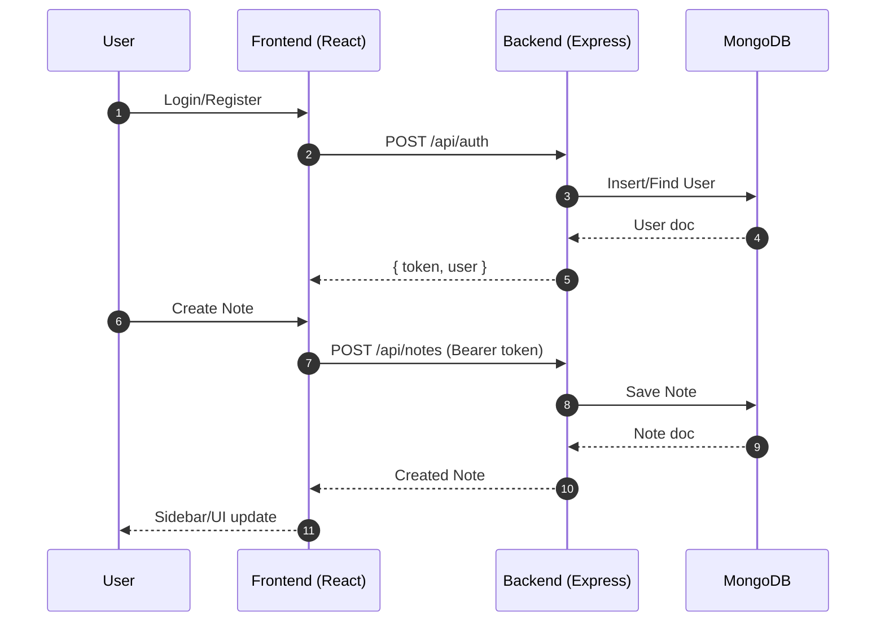
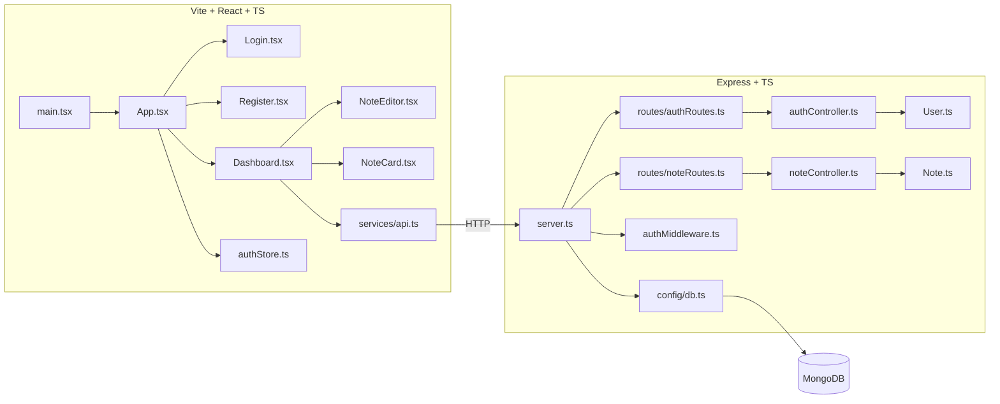

# 📝 Markdown Notes App — Monorepo (Backend + Frontend)

A full-stack **Markdown note-taking app** built with **Node.js + Express + TypeScript** on the backend and **Vite + React + TypeScript** on the frontend.
Includes **rich text editing (TipTap)**, **secure JWT auth**, **note CRUD**, **tags**, and a **dashboard with analytics**.
---

## 🚀 Setup

1. **Clone & Install**

   ```bash
   git clone https://github.com/Yashcu/Notes-App
   cd Notes-App
   cd backend && npm install
   cd ../frontend && npm install
   ```

2. **Configure Environment**

   - Copy `.env.example` or create `.env` files (see [Environment Variables](#-environment-variables)).

3. **Run in Development**

   ```bash
   # Terminal 1
   cd backend && npm run dev
   # Terminal 2
   cd frontend && npm run dev
   ```

   - Backend: `http://localhost:5000`
   - Frontend: `http://localhost:5173`

---

## ⚙️ Environment Variables

**Backend** → `backend/.env`

```env
PORT=5000
MONGODB_URI=mongodb://localhost:27017/notes-app
JWT_SECRET=replace-with-strong-secret
CORS_ORIGIN=http://localhost:5173
```

**Frontend** → `frontend/.env`

```env
VITE_API_URL=http://localhost:5000/api
```

---

## 📜 Scripts

**Backend** (`backend/package.json`):

- `npm run dev` → start dev server (ts-node-dev)
- `npm run build` → compile TypeScript
- `npm start` → run compiled server

**Frontend** (`frontend/package.json`):

- `npm run dev` → start Vite dev server
- `npm run build` → production build
- `npm run preview` → preview prod build

---

## 📂 Project Structure

```
backend/
  src/
    server.ts
    config/db.ts
    middleware/authMiddleware.ts
    models/
      User.ts
      Note.ts
    controllers/
      authController.ts
      noteController.ts
    routes/
      authRoutes.ts
      noteRoutes.ts
    types/request.d.ts

frontend/
  src/
    pages/
      Login.tsx
      Register.tsx
      Dashboard.tsx
    features/notes/
      NoteEditor.tsx   # TipTap editor
      NoteCard.tsx     # Card view
    store/
      authStore.ts     # Zustand global state
    services/
      api.ts           # Axios API
    lib/utils.ts
    types/index.ts
    components/ui/     # shadcn/ui components
    App.tsx
    main.tsx
    index.css
```

---

## 🔗 How Things Connect

- **Backend**

  - `server.ts` → connects DB, mounts routes
  - `routes/*` → controllers
  - `controllers/*` → models
  - `authMiddleware.ts` → JWT validation

- **Frontend**

  - `main.tsx` → mounts `App.tsx`
  - `App.tsx` → React Router setup
  - Auth flow → `Login.tsx`, `Register.tsx` → `api.ts` → backend `/auth`
  - Notes → `NoteEditor.tsx`, `NoteCard.tsx` → API → backend `/notes`

---

## 🔄 End-to-End Request Workflow



---

## 🏗️ Architecture Overview



---

## 📡 API Overview

Base URL: `http://localhost:5000/api`

**Auth**

- `POST /auth/register` → register new user
- `POST /auth/login` → login, returns JWT + user

**Notes (Protected)**

- `GET /notes` → list user’s notes
- `POST /notes` → create note
- `GET /notes/:id` → read note
- `PUT /notes/:id` → update note
- `DELETE /notes/:id` → delete note
- `GET /notes/tags` → get user’s tags

---

---
## 💡 Development Tips
- Configure API base in `frontend/.env` (`VITE_API_URL`).
- Ensure backend CORS allows frontend origin.
- Store JWT in `localStorage` for dev; switch to **HTTP-only cookies** in production.
- Extend TipTap editor in `NoteEditor.tsx` for new formatting options.
- Keep TypeScript types shared across backend + frontend for reliability.
---

## 🤝 Contributing

- Use **feature branches**.
- Write clean PRs with screenshots for UI changes.
- Ensure no **TypeScript errors** before merging.
- Update **README.md** for new endpoints/components.

---
## 👨‍💻 Credits
Built by **Yash** 🚀

---
